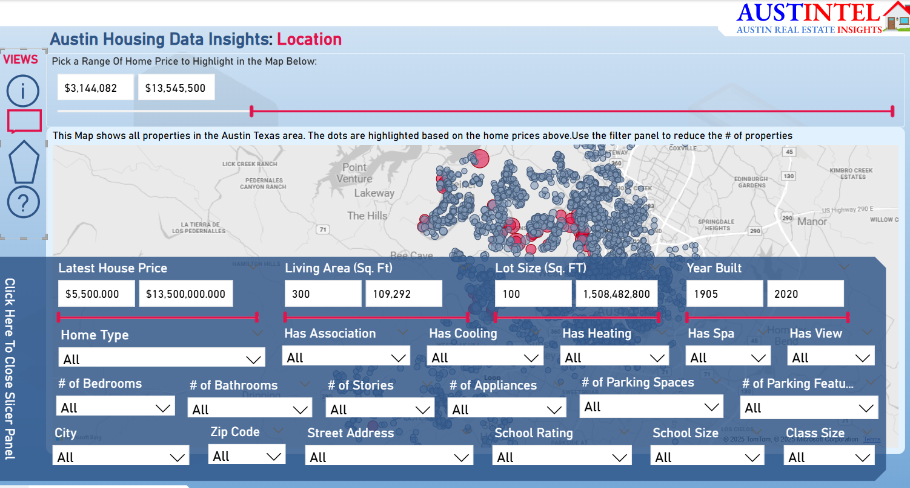

# Etl_powerBi_project_01  =>  PowerBI & DAX

-Etl => This project involves using ETL (Extract, Transform, Load) processes to analyze housing data in order to identify the best home options based on key features such as school quality, location, and house characteristics.

## Requirements

Need to have Power Bi tool

## Installation
Download the file here

## Images

